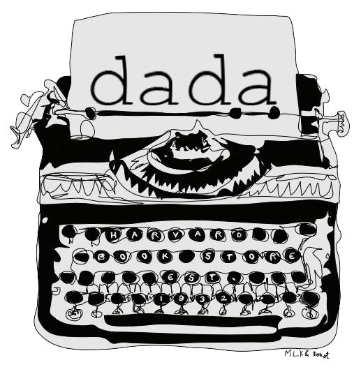

# Surrealist Storyteller

## Introduction

Surrealist Storyteller is a unique mobile app developed in Objective-C that transports users back to the artistic spirit of the 1920s Surrealist parlor games. Embrace your inner surrealist and collaborate with others to create whimsical and imaginative stories and poetry.

## Features

- **Collaborative Storytelling:** Engage in collaborative storytelling and poetry writing with friends and fellow enthusiasts.
- **Surrealist Style:** Experience the surreal and unpredictable nature of storytelling in the spirit of 1920s Surrealism.
- **Objective-C Powered:** Built using Objective-C for robust performance and compatibility on iPhones.
- **User-Friendly Interface:** An intuitive and user-friendly interface ensures a seamless creative experience.

## Getting Started

1. Clone this repository to your local machine.
2. Open the project in Xcode.
3. Build and run the app on your iPhone to start collaborating on surreal stories and poetry.

## How to Use

1. Launch the app and create or join a collaborative storytelling session.
2. Contribute a sentence or verse to the story or poem, building upon the previous contributions.
3. Witness the creative chaos as your story takes unexpected and surreal turns.
4. Revel in the unpredictability and artistic freedom of Surrealist Storyteller.

## License

This project is licensed under the MIT License - see the [LICENSE](LICENSE) file for details.

## Contact

For questions or inquiries about Surrealist Storyteller, please contact [your email address].

---

Join us on a journey through the whimsical and surreal world of collaborative storytelling inspired by the 1920s Surrealist parlor games. Surrealist Storyteller - where imagination knows no bounds.
